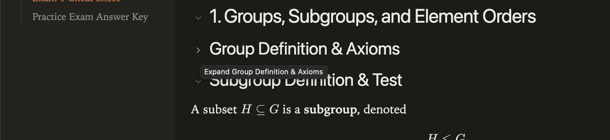

# Heading Folding

Subtle, accessible heading disclosures with automatic expansion for links and complete printed notes.

## Installation

In Obsidian: Settings > Digital Garden > Plugins > Manage plugins > Browse & install. Until listed in the community gallery, use Install from GitHub with `koltensaccount/garden-plugin-heading-folding`. A garden with current plugin support is required. Installation is file copying only; no setup scripts or dependencies need to run on the garden. Save settings and let the site rebuild.

## Usage

Use the small heading disclosure button (Enter/Space on keyboard) to hide content through the next equal/higher heading. Parent folds preserve child fold states. Heading IDs and normal links remain intact. TOC links and hash navigation expand folded ancestors. Fold states last only for the current document. Dynamically added headings are initialized without duplicate buttons. Printing includes all content without changing screen state.

## Compatibility and Accessibility

Core TOC highlighting is corrected when its active target is hidden by a fold, even without TOC Settings. This observes core state rather than installing another scroll tracker.

Works alone and with the other reading plugins. Shared footer controls use the neutral `dg-nav-tools` convention, with a floating fallback when navigation is absent. Each plugin ships the helper it needs; none imports another plugin. Current Digital Garden uses full-document navigation. Initialization is idempotent. Native controls, accessible labels, focus outlines and appropriate ARIA states are retained. Print styles remain separate from screen preferences. Browser storage failures fall back safely.

## Development

Node 22+; `npm ci`, `npm run check`, `npm test`. Tests use Node's test runner and Playwright's driver with an installed Chrome/Edge browser (`CHROME_PATH` overrides discovery). CI uses Ubuntu's Chrome. Browser tests never invoke an OS print dialog. The plugin files are ready to copy directly into `src/plugins/heading-folding/` in a current test garden. Real upstream integration and combination checks are reported in `VALIDATION.md`.

## License

MIT, copyright 2026 Kolten Bendickson.
